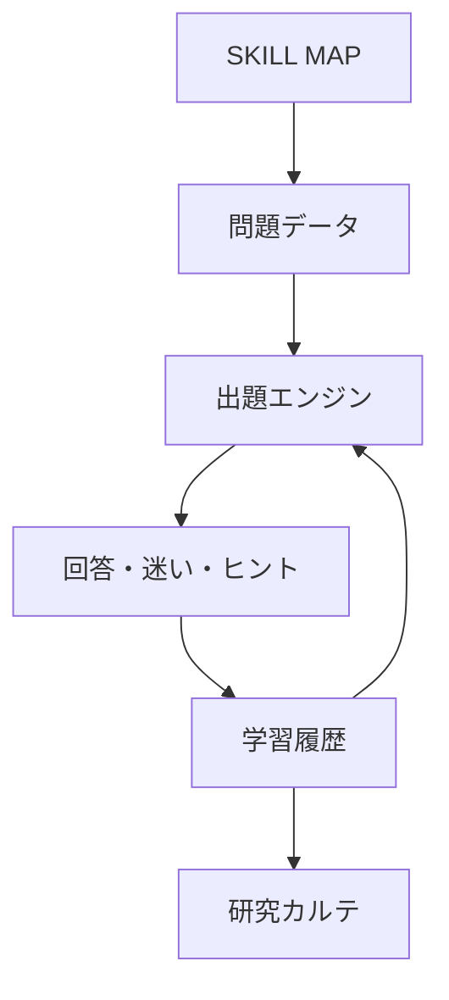

# ことラボ 教育・システム設計 v1.0

## 固定する骨格

| LAB | 最小単位 | 中心となる問い |
|---|---|---|
| ことば | 語・表現 | どのことばがぴったり？ |
| 文づくり | 一文 | どうすれば伝わる文になる？ |
| つながり | 文と文 | どんな関係でつながっている？ |
| 文章 | 文章 | どう組み立てれば伝わる？ |

新しい教材を増やすときもLABを増設せず、4LAB内のSKILLまたはSUBSKILLとして追加する。

## 二つの軸

- `contentLevel`：扱う言語内容の難しさ（1〜6）
- `depth`：気づく → 分ける → 選ぶ → 直す → 使う → 転移する（D1〜D6）

学年、内容の難しさ、習熟の深さを同一視しない。

## データの流れ

文例は `questions.js`、能力体系は `skill-map.js`、判定は `engine.js` に分ける。問題追加のために画面コードを変更しない。

## 現段階の境界

MVPは機械判定できる選択問題を中心にする。自由記述は採点せず「ためしてみよう」として出口に置く。履歴は個人情報を持たず、その端末のブラウザ内にだけ保存する。
